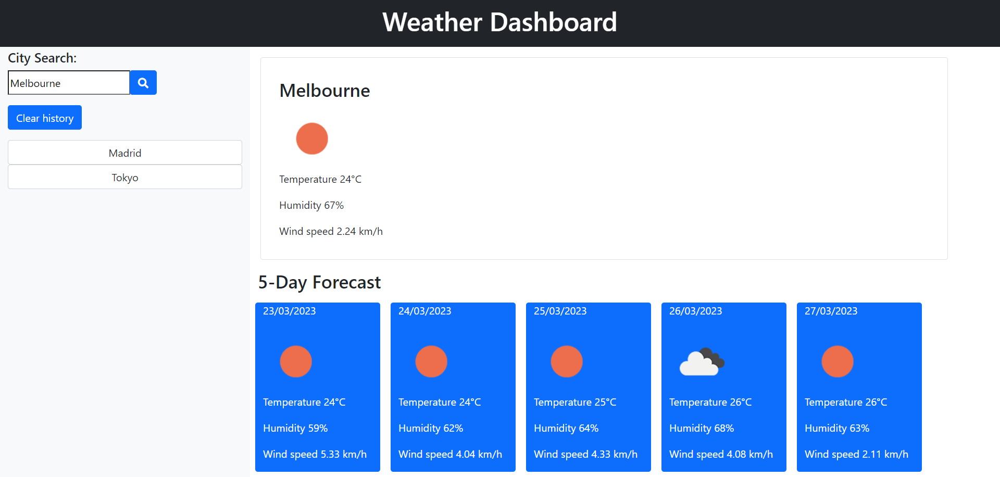

# weather-dashboard

## Description

weather-dashboard is an app that retrieves data from the openweathermap.org API to provide weather forecast for multple global cities. This allows the user to plan any trip accordingly. weather-dashboard runs in the browser and features dynamically updated HTML and CSS to clearly display the aforementioned data when the user inputs the chosen city into the search. The user is then presented with current weather conditions for that city including temperature, humidity and windspeed as well as a despcriptive icon and the city name. In addition there is a five-day forecast which uses a separate API to connect with the data. 
The city, chosen by the user is stored in local storage and then rendered on same page in a searchable button, where the data can be accessed again. 
This weather dashboard app is mobile compatible

## License

[License](/LICENSE)
Copyright (c) 2023 Caro

## Usage


## Credits

chelmore1@bigpond.com

## Badges


    


    ```md
    
    ```

## Credits

List your collaborators, if any, with links to their GitHub profiles.

If you used any third-party assets that require attribution, list the creators with links to their primary web presence in this section.

If you followed tutorials, include links to those here as well.

## License
MIT License

Copyright (c) 2023 Caro

Permission is hereby granted, free of charge, to any person obtaining a copy
of this software and associated documentation files (the "Software"), to deal
in the Software without restriction, including without limitation the rights
to use, copy, modify, merge, publish, distribute, sublicense, and/or sell
copies of the Software, and to permit persons to whom the Software is
furnished to do so, subject to the following conditions:

The above copyright notice and this permission notice shall be included in all
copies or substantial portions of the Software.

THE SOFTWARE IS PROVIDED "AS IS", WITHOUT WARRANTY OF ANY KIND, EXPRESS OR
IMPLIED, INCLUDING BUT NOT LIMITED TO THE WARRANTIES OF MERCHANTABILITY,
FITNESS FOR A PARTICULAR PURPOSE AND NONINFRINGEMENT. IN NO EVENT SHALL THE
AUTHORS OR COPYRIGHT HOLDERS BE LIABLE FOR ANY CLAIM, DAMAGES OR OTHER
LIABILITY, WHETHER IN AN ACTION OF CONTRACT, TORT OR OTHERWISE, ARISING FROM,
OUT OF OR IN CONNECTION WITH THE SOFTWARE OR THE USE OR OTHER DEALINGS IN THE
SOFTWARE.

## Badges


Badges aren't necessary, per se, but they demonstrate street cred. Badges let other developers know that you know what you're doing. Check out the badges hosted by [shields.io](https://shields.io/). You may not understand what they all represent now, but you will in time.


    


## Features

If your project has a lot of features, list them here.

## How to Contribute

If you created an application or package and would like other developers to contribute it, you can include guidelines for how to do so. The [Contributor Covenant](https://www.contributor-covenant.org/) is an industry standard, but you can always write your own if you'd prefer.

## Tests
